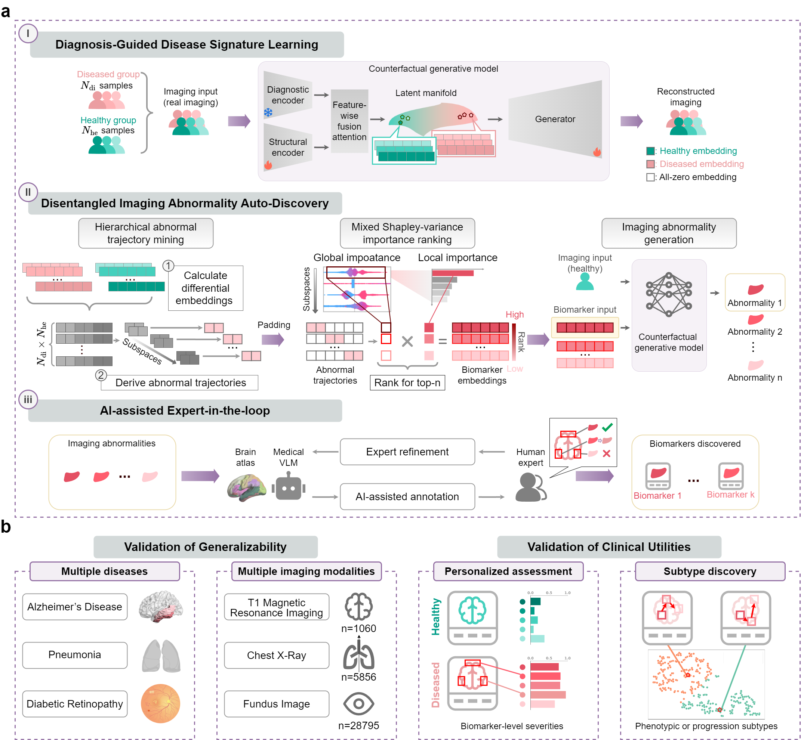

# AID: Auto-discovery of imaging biomarkers using generative artificial intelligence
This is a code implementation of "**Auto-discovery of imaging biomarkers using generative artificial intelligence**"

## Introduction
Medical imaging is centre to modern healthcare by utilizing imaging biomarkers (IBs) to indicate disease presence, severity, and progression. 
The discovery of IBs has traditionally relied on disease-specific pipelines, handcrafted features, and extensive expert curation, limiting scalability and generalizability. 
Here we introduce **AID**, a generalizable framework that **repurposes generative artificial intelligence (AI) as a data-driven engine for automated and interpretable IB discovery**. 
By learning disentangled latent trajectories spanning healthy and diseased states, AID automatically isolating heterogeneous imaging abnormalities into fine-grained IBs, refined through expert-in-the-loop validation. 
Across multiple imaging modalities and diseases, AID recovers established IBs while revealing previously unreported patterns with strong visual disentanglement and high expert agreement. 
AID further enables biomarker-level personalized assessment, reveals disease subtypes, and supports patient stratification. 
Together, our results establish generative AI as **a powerful paradigm for constructing a fine-grained atlas of clinically actionable IBs**, paving the way for **scalable** and **interpretable** solutions for disease detection, diagnosis, and monitoring in modern healthcare.

## Overview of the framework

  

# Datasets
3D grayscale magnetic resonance imaging for Alzheimer's disease: [ADNI](https://adni.loni.usc.edu/)  

2D grayscale chest radiography for pneumonia: [Mendeley](https://data.mendeley.com/datasets/rscbjbr9sj/2)  

2D RGB fundus imaging for diabetic retinopathy: [Eyepacs](https://www.eyepacs.com/) or from [Kaggle](https://www.kaggle.com/c/diabetic-retinopathy-detection)  

# Usage